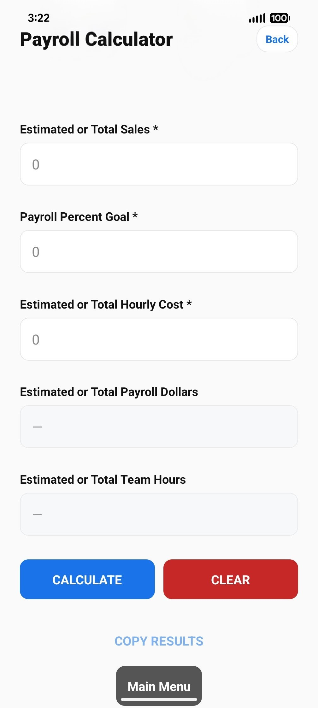
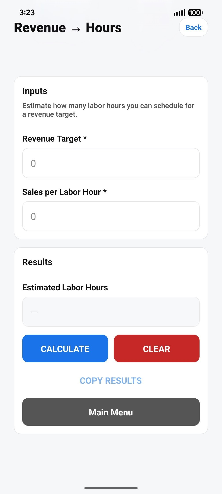
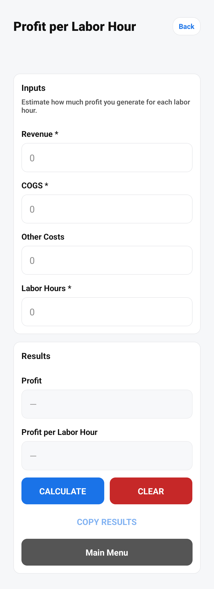
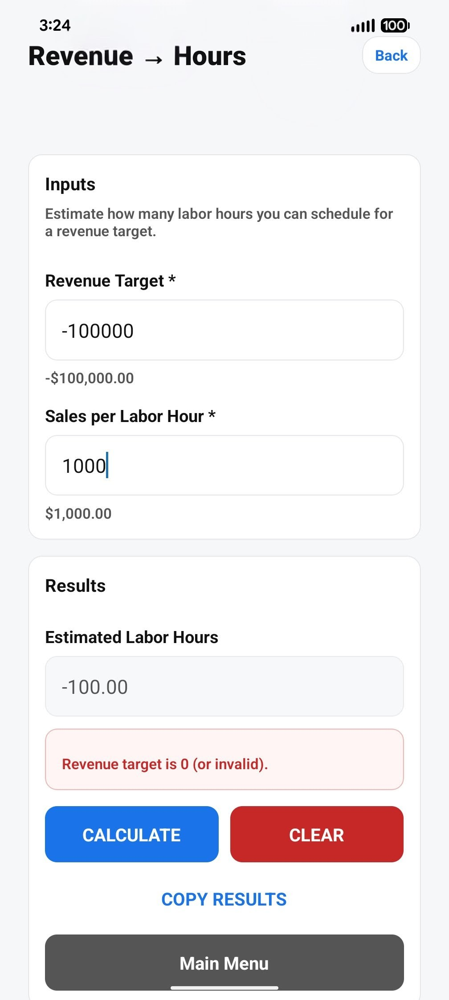
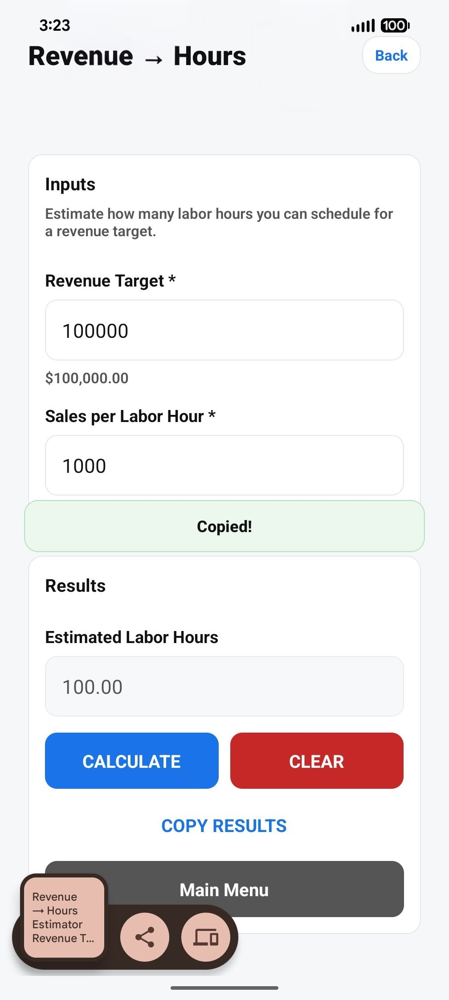

# 📱 Mobile Business Toolkit

A production-minded React Native / Expo application for operational decision-making, staffing, and business analytics.

Mobile Business Toolkit is a modular, testable, and maintainable mobile app for real-world business logic — not just a demo.

---

## ⭐ Overview

**Mobile Business Toolkit** is a React Native / Expo application designed to help managers and operators make fast, informed decisions directly from a mobile device.
It provides:
Modular business calculators
Payroll and staffing estimators
Revenue-to-hours forecasting
Profitability insights per labor hour
Offline-first data persistence
Copyable results for field or store reporting

The long-term goal is a **lightweight operational decision system** which can grow with new features while preserving clean architecture and reusable components.

This repository is intended as a portfolio-grade example of modern mobile engineering practices, as well as a functional piece of sofware for my workplace.

---

## 🎯 Problem This Toolkit Solves

Many operational and mid-market businesses rely on spreadsheets or legacy systems to:

- Estimate staffing needs

- Control payroll percentages

- Forecast revenue versus labor hours

- Plan weekly schedules

- Compare shifts or departments

- Understand profit per labor hour

These tools are often:

- Not mobile-friendly

- Unavailable on-site

- Too slow for real-time decisions

- Designed for back-office use only

Mobile Business Toolkit brings this operational math into a mobile-native interface that works on the sales floor, at a job site, in a warehouse, or during scheduling — even when offline.

---

## 🧩 Architecture Highlights

The app is designed around predictable and scalable patterns with long-term maintainability in mind:

**Key principles:**

**Modular** — each calculator lives in its own folder

**Extensible** — new modules require minimal boilerplate

**Separated concerns** — UI never contains business math

**Offline-first** — non-sensitive data is persisted locally

**Reusable** — shared UI, formatting, and validation utilities

Business logic is isolated, testable, and reusable across screens.

---

## 📂 Project Structure (simplified)

    mobile-business-toolkit/
    ├── app/
    │   ├── _layout.tsx
    │   ├── index.tsx
    │   └── calculators/
    │       ├── payroll/
    │       ├── revenue-hours/
    │       └── profit-per-labor-hour/
    │
    ├── components/
    │   └── ui/
    │       ├── AppButton.tsx
    │       ├── AppField.tsx
    │       ├── AppText.tsx
    │       ├── CalcScreen.tsx
    │       ├── Card.tsx
    │       ├── ErrorBoundary.tsx
    │       ├── Header.tsx
    │       ├── Screen.tsx
    │       └── Toast.tsx
    │
    ├── lib/
    │   ├── calculators/
    │   │   └── */logic.ts
    │   ├── formatting.ts
    │   ├── logging/
    │   └── errors/
    │
    ├── assets/
    │   └── screenshots/
    │
    ├── docs/
    ├── scripts/
    ├── package.json
    ├── tsconfig.json
    └── README.m

Each calculator is **self-contained**, making it easy to add new operational tools without refactoring existing ones.

---

## ✨ Current Features

- Payroll calculator
- Revenue → labor hours calculator
- Profit per labor hour calculator
- Currency, percentage, and hours formatting
- Input validation and edge-case handling
- Warning and error messaging
- Persistent inputs (offline)
- Copy-to-clipboard results with toast feedback
- Centralized error handling
- Unit tests for business logic
- CI for linting, type checking, and tests

---

## 🧪 Testing and Quality

- Jest unit tests for calculator logic
- ESLint with minimal, non-noisy rules
- TypeScript type checking
- Prettier formatting
- GitHub Actions CI:
  - lint
  - typecheck
  - tests

---

## 🚀 Tech Stack

- React Native
- Expo
- TypeScript
- expo-router
- AsyncStorage
- Jest
- GitHub Actions

---

## 🛠 Local Development

    git clone https://github.com/USERNAME/mobile-business-toolkit.git
    cd mobile-business-toolkit
    npm install
    npx expo start

Preview using the **Expo Go** an emulator.

---

## 📸 Screenshots

**Screenshots are stored in:**

    /assets/screenshots

---

## 🔐 Security Notes

- Sensitive data must not be stored in AsyncStorage
- Architecture supports future SecureStore and server sync
- Security considerations are documented in the docs directory

**See:**

- docs/SECURITY.md
- docs/security-checklist.md
- docs/data-classification.md

---

## 🧭 Roadmap (high-level)

Planned enhancements include:

**Business calculators and analytics:**
- Staffing optimization
- Overtime risk assessment
- KPI tracking over time
- Inventory costing
- Job and project costing
- Multi-location rollups

**Framework enhancements:**
- Shared calculator templates
- Expanded validation utilities
- Data export options
- Offline sync engine
- Optional visualization and charts

---

## 🙏 Credits

Maintainer: Robert

Contact: **robert@solartreehouse.org**

---

## 📜 License

This project is licensed under the **Apache License 2.0**.

You may use, modify, and distribute this software for commercial or internal purposes. However, patent rights associated with this work are also licensed, and patent trolling or litigation against the author is prohibited.

See the full license in the `LICENSE` file.
